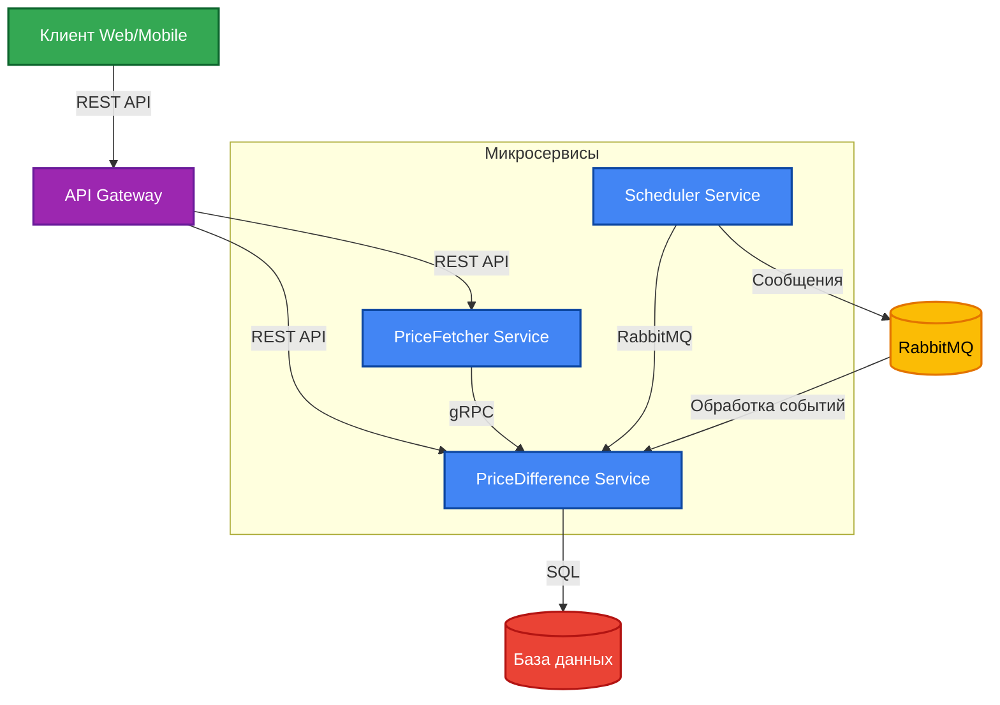

# Сервис мониторинга спредов фьючерсных контрактов

## Описание проекта

Данный проект представляет собой микросервисную архитектуру для мониторинга и анализа разницы цен (спредов) между квартальными и биквартальными фьючерсными контрактами на криптовалюту Bitcoin (BTC). Система собирает данные о ценах с биржи Binance, вычисляет разницу между контрактами за определенные временные промежутки (час/день) и сохраняет результаты в базе данных для последующего анализа.

## Архитектурные решения

### Микросервисная архитектура

Проект реализован с использованием микросервисной архитектуры, что обеспечивает:
- **Масштабируемость**: каждый сервис может масштабироваться независимо
- **Отказоустойчивость**: отказ одного сервиса не приводит к отказу всей системы
- **Технологическая гетерогенность**: возможность использовать разные технологии для разных сервисов

Система состоит из следующих микросервисов:

1. **PriceFetcherService** - сервис для получения данных о ценах фьючерсных контрактов с биржи Binance
2. **PriceDifferenceService** - сервис для расчета и хранения разницы цен между контрактами
3. **SchedulerService** - сервис для планирования и запуска периодических задач

### Чистая архитектура (Clean Architecture)

Каждый сервис разделен на следующие слои:
- **Domain** - содержит бизнес-модели
- **Application** - содержит бизнес-логику и сценарии использования
- **Infrastructure (Code)** - содержит реализации интерфейсов и интерфейсы для работы с внешними системами
- **Api (Areas)** - содержит контроллеры

### Коммуникация между сервисами

Для коммуникации между сервисами используются следующие подходы:
- **API Gateway** - для централизованной маршрутизации запросов клиентов к соответствующим микросервисам
- **gRPC** - для высокопроизводительного взаимодействия между сервисами
- **RabbitMQ** - для асинхронного взаимодействия между сервисами

## Используемые паттерны проектирования (Gang of Four)

### Порождающие паттерны (Creational Patterns)

1. **Фабричный метод (Factory Method)**
   - Используется в `PriceFetchingStrategyFactory` для создания различных стратегий получения цен
   - Позволяет создавать объекты без указания их конкретных классов

2. **Абстрактная фабрика (Abstract Factory)**
   - Используется для создания семейств связанных объектов
   - Реализовано в инфраструктурном слое для создания репозиториев и клиентов

3. **Одиночка (Singleton)**
   - Используется для сервисов, которые должны существовать в единственном экземпляре
   - Реализовано через DI-контейнер для `RabbitMQService` и `PriceFetchingStrategyFactory`

### Структурные паттерны (Structural Patterns)

1. **Адаптер (Adapter)**
   - Используется в `PriceFetcherClient` для адаптации внешнего API к внутреннему интерфейсу
   - Позволяет объектам с несовместимыми интерфейсами работать вместе

2. **Декоратор (Decorator)**
   - Используется в `RateLimitingPriceFetchingDecorator` для добавления функциональности ограничения запросов
   - Позволяет динамически добавлять новую функциональность объектам

3. **Прокси (Proxy) (не имплементирован)**
   - Используется в `GrpcPriceFetcherClient` для контроля доступа к удаленному сервису
   - Обеспечивает дополнительный уровень косвенности при доступе к объекту

4. **Фасад (Facade) (не имплементирован)**
   - Используется в `SpreadCalculationService` для упрощения сложной подсистемы расчета спредов
   - Предоставляет унифицированный интерфейс к набору интерфейсов подсистемы

### Поведенческие паттерны (Behavioral Patterns)

1. **Стратегия (Strategy)**
   - Используется в `BinanceFuturesPriceFetchingStrategy` для инкапсуляции алгоритмов получения цен
   - Позволяет выбирать алгоритм во время выполнения

2. **Наблюдатель (Observer) (не имплементирован)**
   - Используется в системе обработки событий через RabbitMQ
   - Позволяет объектам уведомлять другие объекты об изменениях своего состояния

3. **Команда (Command) (не имплементирован)**
   - Используется в обработчиках запросов MediatR
   - Инкапсулирует запрос как объект, позволяя параметризовать клиентов с запросами

4. **Посредник (Mediator) (не имплементирован)**
   - Реализовано через библиотеку MediatR
   - Обеспечивает слабую связанность между компонентами системы

5. **Цепочка обязанностей (Chain of Responsibility) (не имплементирован)**
   - Используется в middleware для обработки HTTP-запросов
   - Позволяет передавать запросы по цепочке обработчиков

## Схема архитектуры

Схема демонстрирует взаимодействие между компонентами системы:

- **Клиент** взаимодействует с системой через **API Gateway**, который распределяет запросы
- **API Gateway** маршрутизирует REST API запросы к соответствующим микросервисам
- **PriceFetcher Service** получает данные от Binance API и передает их в PriceDifference Service через gRPC
- **Scheduler Service** отправляет задания через RabbitMQ в PriceDifference Service
- **PriceDifference Service** сохраняет результаты в базе данных

## Заключение

Выбранная архитектура обеспечивает высокую масштабируемость, отказоустойчивость и гибкость разработки. Использование принципов чистой архитектуры и паттернов проектирования позволяет создать систему, которая легко расширяется и поддерживается. Микросервисный подход обеспечивает независимость разработки и развертывания сервисов, а использование современных технологий обеспечивает высокую производительность и надежность системы.
